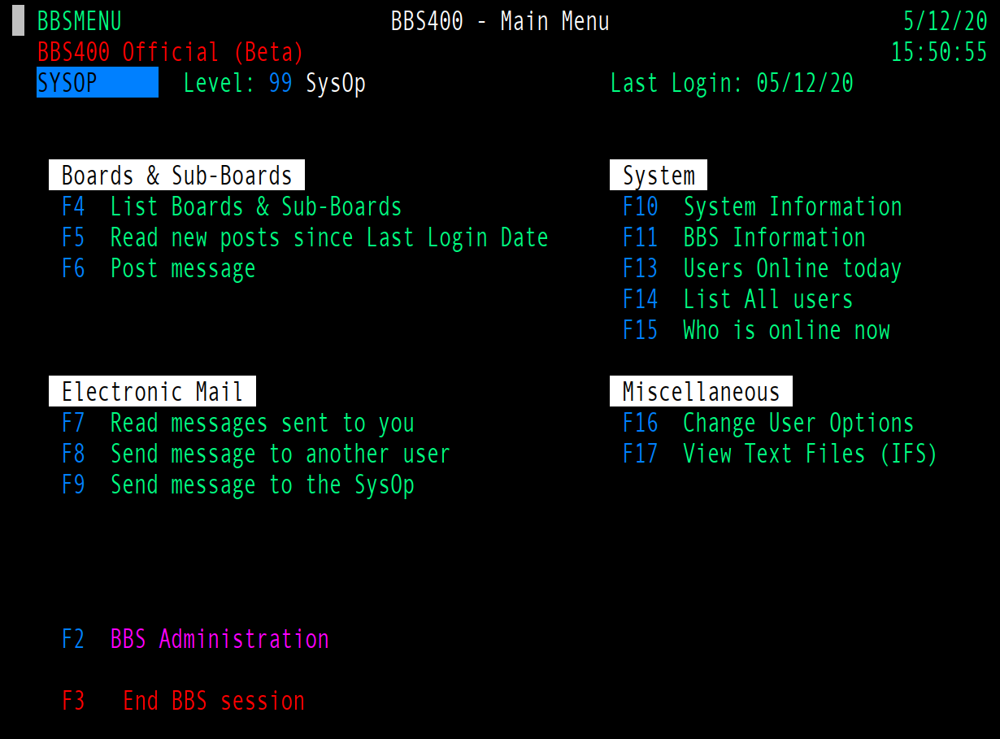
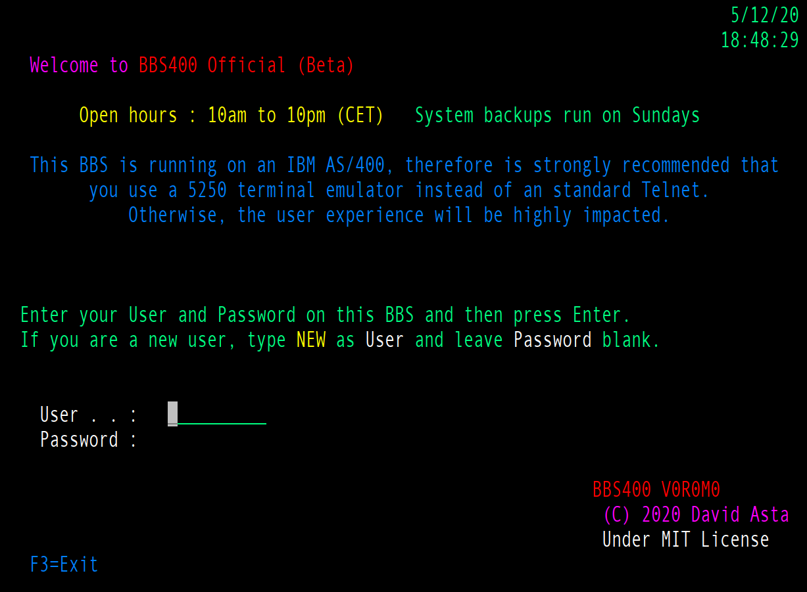

# BBS400
BBS400 is a Bulletin Board System (BBS) for IBM AS/400 computers.

I believe BBS400 is the first and only BBS software for IBM midrange computers. If you have heard of any other, please let me know and I will change this sentence.

I was very fond of BBSes before the Internet and I think this was never done for AS/400. Of course, companies were not interested and individuals couldn't afford buying one.

Old AS/400 are being retired and nowadays it is possible to get hold of one. I'm the proud owner of an AS/400e Model 150 running OS/400 V4R5, in which I have developed BBS400 using ILE RPG and CLP.

If you are curious, you can access it with a 5250 emulator connecting to dasta400.freeddns.org at port 29012 and SSL/TLS enabled. Once at the signon screen enter BBS400 as user and password and then the BBS program will be started. It is usually running on weekdays between 10am to 10pm CET.

## Current Features

* Multiple Boards and Sub-Boards, where user can post messages of up to 1125 characters.
* List new posted messages since last login into the BBS.
* See list of users (All, logged today, online now).
* Send private messages to other BBS users.
* View Integrated File System (IFS) files.
* Help available on all screens.
* Notification of new message received (only if BBS user is same as AS/400 user).
* Admistration menu accessible only for SysOps (like a QSECOFR of the BBS)
  * Configure different parameters:
    * Information details (BBS name, Location, Time zone).
    * Open/close to new user registrations.
    * Specify an AS/400 account that will get notified when a new user registers.
  * Manage Boards and Sub-Boards:
    * Add/Edit/Delete.
    * Change Access Levels for Read/Post independently.
  * Manage Users:
    * Change Access Level.
    * Delete.
  * Manage Access Levels:
    * Add/Edit/Delete.
    * Change expiration days.
    * Specify new Access Level once account expires.
    * Grant/Deny access to list of users.
    * Grant/Deny access to list of users online now.
    * Grant/Deny access to post messages on Boards and Sub-Boards.
    * Grant/Deny access to send messages to other users.
  * Configure default values for new registered accounts.
  * Add available IFS files.
  * Turn On/Off Maintenance Mode.

## Concepts

### Access Levels

Each BBS400 user account have an Access Level assigned, which grants access to different functionalities of the BBS and also controls the expiration times for inactive accounts (inactive meaning not logged in since certain number of days).
                                                                           
The SysOp can define in the Administration menu which Access Level is assigned to New Users when they register. The default value is 20.
                                                                           
Access Levels are used then by the BBS400 software to check which parts of the BBS a specific user have access. For example, the SysOp may decide that to be able to see the list of BBS users, the minimum level is 30. Hence, users with Access Level less than 30 won't be able to see such list.       

The Access Levels are also used for granting view, read and post in each of the different Sub-Boards. Thus, the SysOp can configure the BBS to for example have a Sub-Board where users with level 30 can read, but only users with level 40 and above can post.                                          
                                                                           
The default values are configured as follows when BBS400 is installed:
                                                                          
* **Level 20**
  * Expires after 10 days of inactivity.
  * Cannot see the list of users.
  * Cannot see the System Information.
  * Cannot send messages to other users. Cannot post messages on Sub-Boards.           
* **Level 21**
  * Expires after 120 days of inactivity.
  * It can see all of the above that Level 20 cannot.
  * This is meant to be assigned by the SysOp, once the newly registered account has been checked.
* **Level 30**
  * Expires after 365 days of inactivity.
  * It can see all.
* **Level 90**
  * Does not expire.
  * This is meant for Co-SyOps.
* **Level 99**
  * Does not expire.
  * This is the level of SysOp.
                                                                             
Every SysOp can add or remove, as well as modify the default values above, hence each BBS may be completely different.

### Maintenance Mode

When the SysOp is doing maintenance tasks (e.g. backup, installing new release), the BBS can be set up as Maintenance Mode. When in this mode, the BBS will only accept logins from the SysOp account.

## How to install

If you got the source code:
* Edit the *#BUILD* CLP and change the values of &LIBOBJ and &LIBDTA to what you likes. By the default are PBBS400OBJ and PBBS400DTA. I have two, because I prefer to have programs separated from data. It makes easier to just backup the data library instead of all.
* Once changed. Compile it and CALL it. It will compile everything and run a small SQL statement.
* After the compilation is finished, call BBS400PROD with 2 parameters: the name of the OBJ lib and the name of the DTA lib.
* The BBS will be started in Maintenance Mode and with user SYSOP created. Password is also SYSOP.

I recommend to first go to *Change User Options* (F16) and change the password. Next go to to *BBS Administration* menu (F2) and start configuring the BBS. Once finished, from the *BBS Administration* menu, press F24 to set the Maintenance Mode OFF and allow users to register.

## Roadmap

This is a non-exhaustive list of feaures I have currently in mind:

* Show dates in American format (MM/DD/YY). Currently it's DD/MM/YY only.
* Polls (allow to create, answer, view).
* Allow to reply to a post from the same screen when displaying the post.
* Calling external programs.
* Highlight Unread messages in a different colour.
* Highlight SysOp's messages if PCONFIG.HISOPS = 'Y' in a different colour.
* Add an Admin option to hide (Y/N) SysOp from list of Users.
* When deleting a Sub-Board, delete messages from DB too.
* Make subfiles expanding. Currently it's using Load-all, and therefore there is a limitation of loading a maximum of 9999 records in a subfile.
* Investigate possibility of running it on its own subsystem (SBS).
* Investigate possibility getting access to the BBS software directly, instead of having to signon with BBS400 account first.

## Changelog
                                                                           
* **V0R0M0**: Beta release.